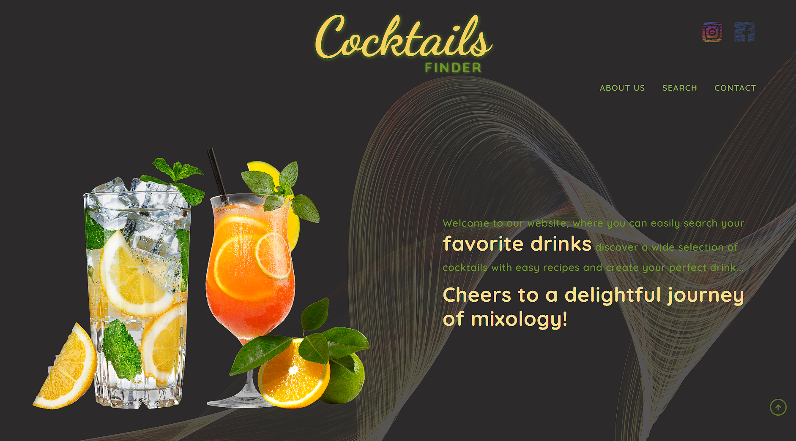
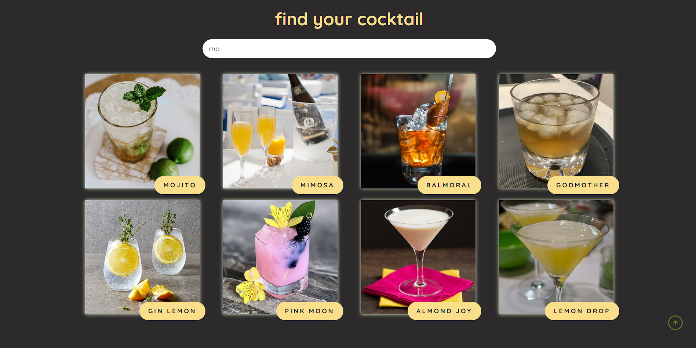

# Cocktails finder🍹

A simple site used to search for your favorite drinks from the database. The application allows you to quickly find interesting drinks by entering their name in the search field. Thanks to this, users can instantly find recipes for their favorite drinks or discover completely new ones that they would like to try.

## Main Features

-   **Searching for drinks**: The application allows you to quickly find interesting drinks by entering their name in the search field.

-   **Drink information**: After selecting an interesting drink from the search results, the user has access to information about it. The page presents a list of ingredients needed to prepare a given drink.

-   **Intuitive interface**: The website has been designed with simplicity and intuitiveness in mind. A clear layout and legible buttons allow you to move smoothly through the application and quickly find the information you need.

## Quick setup and start

In order to run webpage you need HTTP sever which serve the site, for example Live Server.

## Built With

-   HTML,
-   CSS,
-   JavaScript.

The API used on the site comes from: https://www.thecocktaildb.com

<small>**Page is not responsive - work is in progress!**</small>
